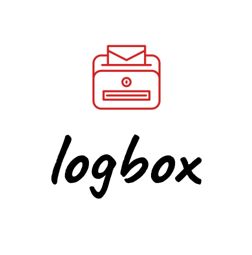
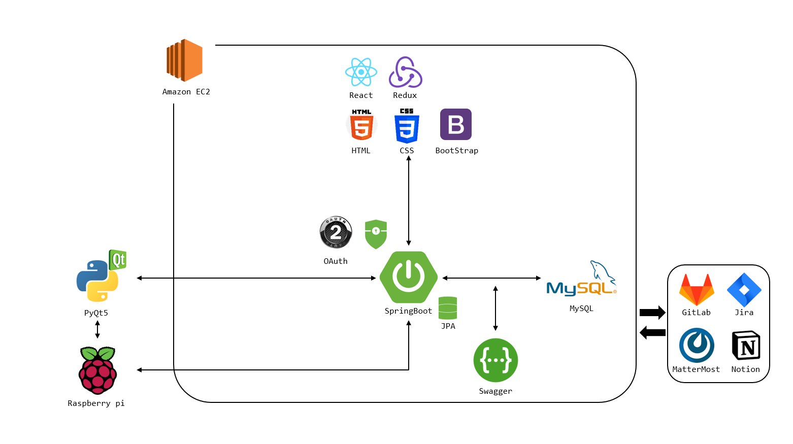

# 프로젝트 기본 구조

Epic: 프로젝트 기획
Status: 완료
설명: 진행 기간, 배경, 개요, 기술, 협업 툴, 팀원 역할 분배 등 프로젝트 전반적인 기본 구조

## 프로젝트 진행 기간

---

- 2023.01.03-2023.02.17
- SSAFY 8기 2학기 공통 프로젝트 - 추억우체통

## 로그박스 - 배경

---

이전과 다르게 저희는 카카오톡으로 안부를 주고받으며, 인스타그램으로 일상을 공유합니다. 이러한 생활은 우리에게 편리함을 제공하지만 추억과 여유를 가져갔습니다. 최근 우체통을 써보신 적 있으신가요? 저희는 당신의 사진과 글 그리고 영상이 담긴 세상에 단 하나뿐인 엽서를 우편으로 보내드립니다. 이 우편은 당신께 아주 천천히 찾아갈 것입니다.

우리는 보통 여행지에서의 그 감정, 생각, 배경, 이 모든 것을 사진 하나에 담아 갑니다. 사진을 찍으며, ‘사진만으로는 이 순간을 담아가기 아쉽다!’, ‘나의 추억을 소중한 이들과 공유할 수 없을까?’ 라는 생각을 해 보신적 있나요? 추억을 여행이 끝난 후에 또 한번 느낄 수 있다면 어떨까요? “추억 우체통”은 이러한 니즈를 충족시켜주기 위해 만들어진 IoT기반 우편 시스템입니다. 추억 우체통과 함께라면 세상에 하나뿐인 나만의 엽서로 추억을 선물할 수 있습니다.

## 로그박스 - 개요

---

추억 우체통은 여행지에서의 사진과 영상을 남기고, 글을 통해 기록하여 순간의 소중함을 담아 우편으로 보내는 IoT 기반 우편 시스템 입니다. 사진을 고르고, 편지를 꾸미는 등 엽서를 직접 커스텀 할 수 있습니다. 따라서 세상에 하나뿐인 나만의 엽서를 만들어 소중한 이들과 추억을 공유할 수 있습니다. 또한, 회원가입을 통한 SNS 기능을 통해, 또 다른 이들과 추억을 공유하고 언제 어디서든 내 기억을 꺼내 볼 수 있습니다.

소중한 추억을 오랫동안 간직하길 바랍니다.

### 주요 기능

---

- **사진, 영상 기록**
  - 즉석에서 사진과 영상으로 추억을 남길 수 있습니다.
  - 촬영한 사진과 하고 싶었던 말을 엽서에 담아보세요.
- **한줄 편지**
  - 터치 스크린을 이용하여 나만의 손글씨로 적어 보세요.
  - 오늘의 날짜, 하고 싶은 말 등을 한줄로 자유롭게 작성하세요.
- **엽서 커스텀**
  - 세상에 하나밖에 없는 나만의 엽서를 만들어 보세요.
  - 추억을 선물할 사람에게 마음을 담은 편지를 작성해 보세요.
- **우체통**
  - 소중한 사람에게 당신의 추억을 우편으로 선물하세요.
  - 추억을 우편으로 받아 선물처럼 그날의 기분을 느껴보세요.
- **나만의 편지**
  - 회원가입을 통해 내 편지를 확인해 볼 수 있습니다.
  - 내가 만든 엽서는 내 편지함에 보관할 수 있습니다.
  - 다른 지역에서 만든 추억을 언제 어디서나 열어보세요.
- **SNS**
  - 다른 유저를 팔로우하여 함께 추억을 공유해 보세요.
  - 카카오톡을 통해 팔로우 맺은 친구에게 나의 추억을 보내줄 수 있습니다.

## 프로젝트 아키텍처

---

## 주요 기술

---

### **Backend**

- Spring Boot
- Spring Data - JPA
- Spring Security - OAuth
- Swagger
- Maria DB
- IntelliJ

### **Frontend**

- React.js
- Redux
- HTML
- CSS
- BootStrap
- Visual Studio Code

### **IoT**

- RaspberryPi
- PiCamera
- PyQT (GUI)
- PyCharm Community

### 협업 툴

- Git
- Notion
- JIRA
- MatterMost
- Webex

### 협업 환경

- Gitlab
  - 코드의 버전을 관리
  - 협업을 위한 도구
- JIRA
  - 매주 목표량을 설정하여 Sprint 진행
  - 업무의 할당량을 정하여 Story Point를 설정하고, In-Progress -> Done 순으로 작업
- 회의
  - 데일리 스크럼을 통해 전날 진행된 업무와 당일 진행할 업무, 이슈사항을 공유 한다.
- Notion
  - 모든 회의는 회의록에 기록하여 보관
  - 산출물(기능 명세서, 요구사항 명세서 등) 관리

## 팀원 역할 분배

---

- 추호성(팀장, Back-end)
  - PJT 전반 설계 및 관리
  - DB 설계 및 관리
  - API 설계 및 관리
- 김동수 (Front-end)
  - 아키텍쳐 설계
  - 기획 및 API 설계
  - 디자인 및 UI / UX
  - 와이어 프레임 설계
- 이준혁(Front-end)
  - 아키텍쳐 설계
  - 기획 및 API 설계
  - 디자인 및 UI / UX
  - 와이어 프레임 설계
- 김승기(IoT 개발)
  - IoT 개발
- 김지선(IoT 개발)
  - IoT 개발
- 이다은(IoT 개발)
  - IoT 개발
